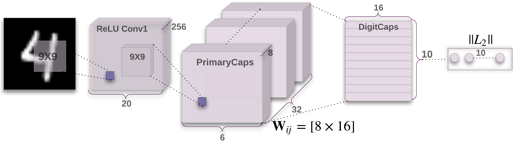
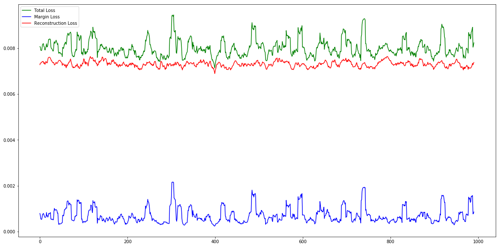

# CapsNet pytorch
This is a [pytorch](http://pytorch.org/) implementation of CapsNet, described in the paper [Dynamic Routing Between Capsules](https://arxiv.org/abs/1710.09829) - by [Sara Sabour](https://arxiv.org/find/cs/1/au:+Sabour_S/0/1/0/all/0/1), [Nicholas Frosst](https://arxiv.org/find/cs/1/au:+Frosst_N/0/1/0/all/0/1) and [Geoffrey E Hinton](https://arxiv.org/find/cs/1/au:+Hinton_G/0/1/0/all/0/1).

## Results on MNIST

### Accuracy
Although the paper reports an accuracy of *99.75%*, the maximum accuracy achieved by this implementation was **99.68%**.

### Number of Parameters
Model has 8141840 parameters.

## Usage
`python train.py --epoch 1500`

## Reference
[acburigo/CapsNet](https://github.com/acburigo/CapsNet/edit/master/README.md)
